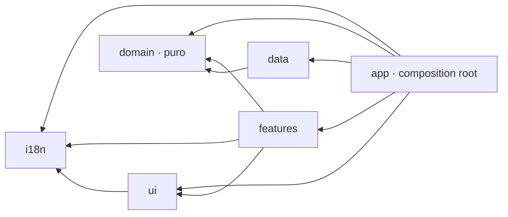
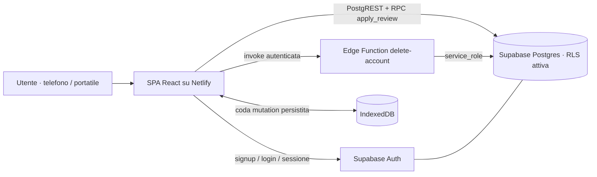
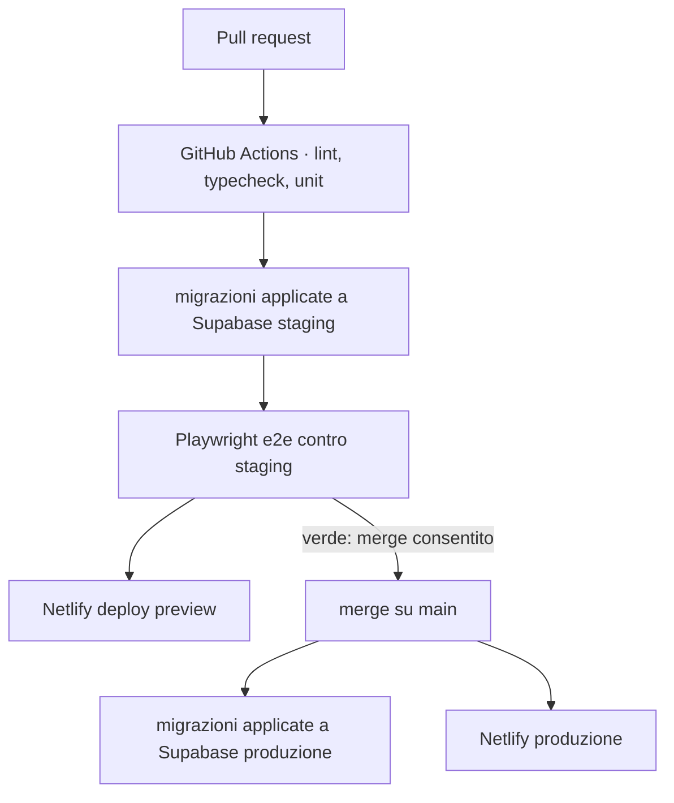
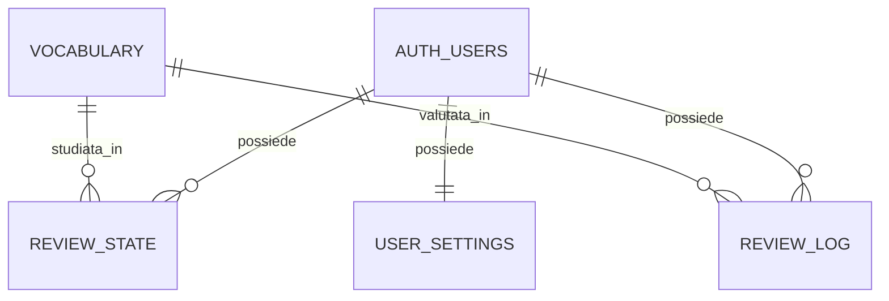

# Architecture Spine — Tsundoku Zero

## Design Paradigm

**Esagonale ridotto (ports & adapters), quattro livelli più un composition root.**

Il dominio dichiara le interfacce dei dati di cui ha bisogno; gli adattatori le implementano. Nessun livello conosce chi lo usa.

| Livello | Cartella | Conosce | Non conosce |
|---|---|---|---|
| Dominio | `src/domain/` | niente | React, Supabase, rete, orologio |
| Adattatori | `src/data/` | dominio | React |
| Presentazione | `src/ui/` | i18n | dominio, dati |
| Funzionalità | `src/features/` | dominio, ui, i18n | Supabase |
| Composition root | `src/app/` | tutti | — |

**Vincolo di prodotto che sovrascrive il default "meno è meglio".** Tsundoku Zero è uno showcase di competenze a supporto di una candidatura per lavorare in Giappone. Una semplificazione che rimuove una tecnologia dimostrabile è la scelta sbagliata per *questo* progetto. Formalizzato in AD-20, perché senza è la prima cosa che un lettore successivo taglia.

## Invariants & Rules



Ogni freccia assente è vietata. In particolare `features` **non** importa `data`: gli adattatori nascono in `app` e arrivano alle schermate come porte.

### AD-1 — Nucleo di dominio puro, dipendenze a senso unico `[ADOPTED]`

- **Binds:** all
- **Prevents:** logica di studio che si sparpaglia nei componenti; backend non sostituibile; test che richiedono rete
- **Rule:** `src/domain/` non importa React, `@supabase/supabase-js`, `fetch`, storage o orologio. La direzione delle dipendenze è quella del grafo sopra. Imposta da `eslint-plugin-boundaries`: una violazione è CI rossa, non una nota di revisione. `dependency-cruiser` genera `docs/dependency-graph.svg` a ogni build.

### AD-2 — Le porte sono dichiarate dal dominio

- **Binds:** all
- **Prevents:** due funzionalità che accedono ai dati con forme diverse; impossibilità di testare il flusso di studio senza database
- **Rule:** le interfacce vivono in `src/domain/ports/` (`VocabularyRepository`, `ReviewRepository`, `SettingsRepository`, `Clock`). Solo `src/data/` le implementa, ed è l'unica cartella che può importare `@supabase/supabase-js`. `src/app/` istanzia gli adattatori e li inietta; i test iniettano implementazioni in memoria.

### AD-3 — Il tempo è un parametro, mai un ambiente `[ADOPTED]`

- **Binds:** F5, F7, NFR2
- **Prevents:** due unità che leggono l'ora in modi diversi, producendo `due_at` e streak incoerenti; test non deterministici
- **Rule:** ogni funzione di dominio che dipende dal tempo riceve `now: Date` **e** `timeZone: string` come parametri espliciti. Sotto `src/domain/` sono vietati `Date.now()`, `new Date()` senza argomenti e `Intl.DateTimeFormat().resolvedOptions()`. Il fuso è quello del dispositivo (FR7.4) e viene letto una sola volta, in `src/app/`.

### AD-4 — Determinismo senza casualità

- **Binds:** FR5.5, FR6.3, NFR3
- **Prevents:** due implementazioni che ricorrono a `Math.random()`, rendendo la pila irriproducibile e i test instabili
- **Rule:** la dispersione delle scadenze (FR5.5) e la selezione dei nuovi item (FR6.3) sono funzioni pure di input espliciti — `vocabulary_id`, `stage`, insieme già visto, tetto giornaliero. Nessun `Math.random()` sotto `src/domain/`, imposto da regola di lint.

### AD-5 — Una sola definizione di "dovuto"

- **Binds:** F3, F4, F6, F9
- **Prevents:** la dashboard che dice 23 e la sessione che ne carica 21; il cancello dei nuovi item (FR6.1) che si apre su un conteggio diverso da quello mostrato
- **Rule:** `isDue(state, now)` è una funzione pura in `src/domain/`. Una sola porta la interroga (`ReviewRepository.listDue`), e conteggio della dashboard (FR3.1), precarico della sessione (FR9.1) e cancello dei nuovi item (FR6.1) leggono **la stessa chiave di query** TanStack. Nessuna schermata ricalcola la pila per conto proprio.

### AD-6 — Zustand ospita, il dominio decide

- **Binds:** F4, F5, FR5.4
- **Prevents:** FR5.4 ("intervallo zero = in fondo alla coda corrente") implementata nel livello UI; due sorgenti di verità sulla coda di sessione
- **Rule:** lo store di sessione contiene stato e azioni che delegano a `sessionReducer()` in `src/domain/`. Nessun calcolo di scheduling o di coda dentro lo store. Lo store **non** è persistito: la sessione è effimera per specifica, e FR4.7 la ricostruisce dagli item ancora dovuti.

### AD-7 — Una valutazione è una sola chiamata, transazionale e idempotente

- **Binds:** F5, F7, F9, CM2
- **Prevents:** `review_log` e `review_state` che divergono su un fallimento parziale; uno stadio avanzato due volte da un ritentativo, che falserebbe statistiche e contro-metrica CM2
- **Rule:** il dominio calcola il nuovo stato **sul client e nell'istante in cui l'utente valuta** — mai al momento dell'invio: una valutazione data in galleria e sincronizzata mezz'ora dopo deve produrre lo stesso `due_at` che avrebbe prodotto subito. La mutation trasporta il risultato già calcolato insieme a `reviewed_at`; il drenaggio della coda non ricalcola nulla. Nessuna logica di scheduling in SQL. La persistenza è una sola RPC `apply_review(review_id, vocabulary_id, outcome, stage, due_at, reviewed_at)` che in una transazione inserisce in `review_log` con `ON CONFLICT (review_id) DO NOTHING` e aggiorna `review_state` **solo se l'insert ha prodotto una riga**. `review_id` è un UUID generato dal client al momento della valutazione: è la chiave di idempotenza di FR9.6.

### AD-8 — La coda offline è TanStack Query, con quattro vincoli

- **Binds:** F9, NFR7
- **Prevents:** mutation non riprendibili dopo un riavvio; valutazioni applicate fuori ordine sullo stesso item; un indicatore di sync che diverge dallo stato reale della coda
- **Rule:**
  1. la `mutationFn` è registrata al bootstrap con `setMutationDefaults(['review'], …)` in `src/app/`, **mai** in un componente: alla reidratazione il componente può non esistere e `resumePausedMutations()` fallirebbe con `No mutationFn found`;
  2. ogni mutation di valutazione porta `scope: { id: 'review-sync' }`, così la coda si drena in serie e l'ordine è garantito;
  3. il persister scrive su IndexedDB con `throttleTime` ≤ 250 ms — la finestra di perdita si stringe, non si azzera, ed è un limite noto accettato;
  4. `resumePausedMutations()` viene chiamata all'avvio e al ritorno online; l'indicatore di FR9.4 deriva da `useMutationState`, non da uno stato proprio.

  L'aggiornamento ottimistico di NFR7 avviene sulla cache TanStack e sullo store di sessione prima dell'invio.

### AD-9 — Identità del vocabolario derivata dal contenuto

- **Binds:** F2, FR2.3, OQ-5
- **Prevents:** un riseed che orfana ogni `review_state` e manda in fumo la promessa di FR2.3, in silenzio
- **Rule:** `vocabulary.id = uuidv5(natural_key, NAMESPACE)` con `natural_key = "kana|kanji|meaning_en"` normalizzata (NFKC, trim, minuscole sul campo inglese). Il seed è un upsert su `id`. Un `TRUNCATE` seguito da riseed deve produrre id identici, e un test lo verifica. Conseguenza accettata: correggere la grafia di una voce ne cambia l'id, quindi è una voce nuova.

### AD-10 — Isolamento per riga su ogni tabella per-utente, verificato

- **Binds:** NFR5, F7, §7 del PRD
- **Prevents:** una tabella aggiunta più tardi senza policy — il modo in cui questo difetto si presenta davvero
- **Rule:** RLS abilitata su `review_state`, `review_log`, `user_settings`, con policy `user_id = auth.uid()` su select, insert, update e delete. `vocabulary` ha RLS abilitata, sola lettura per utenti autenticati, **nessuna** policy di scrittura: il dataset entra solo per migrazione. Un test di integrazione dimostra che l'utente A non legge le righe di B. Una nuova tabella per-utente senza policy è un difetto bloccante, non una nota da sistemare dopo.

### AD-11 — La cancellazione account passa da una Edge Function

- **Binds:** FR1.4, NFR6, §7 del PRD
- **Prevents:** una promessa di cancellazione che il browser non può mantenere — la chiave anon non può cancellare un utente, e la `service_role` non può stare nel bundle
- **Rule:** Edge Function `delete-account`, autenticata, che verifica il chiamante e usa la `service_role` per `auth.admin.deleteUser`. Le tabelle per-utente cancellano in cascata su `auth.users`. La `service_role` non compare mai in codice client né in variabili `VITE_*`. Verificata da un test e2e che, dopo la cancellazione, ritenta il login e interroga le tabelle. È **l'unico** codice server del progetto.

### AD-12 — Migrazioni versionate, schema mai toccato a mano

- **Binds:** F2, F3–F7, NFR3, ambienti
- **Prevents:** staging e produzione che divergono, e test e2e verdi contro uno schema che non è quello che va in produzione
- **Rule:** ogni cambiamento di schema, policy RLS e funzione RPC vive in `supabase/migrations/`. Staging e produzione ricevono le stesse migrazioni dalla stessa pipeline. Nessuna modifica dallo Studio Supabase.

### AD-13 — I test e2e non condividono dati

- **Binds:** NFR3, ambienti
- **Prevents:** run paralleli che collidono sul database di staging condiviso, e test che dipendono da uno stato residuo del run precedente
- **Rule:** ogni run e2e crea utenti con email univoca per run e li rimuove alla fine tramite la stessa Edge Function di AD-11. Nessuna fixture condivisa, nessun utente di test permanente. La CI che gira su ogni PR mantiene di fatto attivo il progetto Supabase di staging.

### AD-14 — Nessuna stringa visibile cablata

- **Binds:** F8, NFR4
- **Prevents:** metà interfaccia tradotta, e chiavi mancanti che si scoprono a runtime
- **Rule:** ogni stringa visibile passa da `t()`. Le chiavi sono tipizzate via declaration merging su `CustomTypeOptions` di i18next: una chiave inesistente è un errore di compilazione. Il contenuto giapponese **non** passa da i18n — è dato, non interfaccia — ed è marcato `lang="ja"`.

### AD-15 — L'accessibilità della sessione è un contratto, non una rifinitura

- **Binds:** NFR4, F4
- **Prevents:** due schermate che annunciano in modi diversi, o scorciatoie che cambiano fra sessione e nuovi item
- **Rule:** spazio rivela, i tasti `1`–`4` valutano nell'ordine `again`, `hard`, `good`, `easy`. Una **sola** live region `aria-live="polite"` per sessione annuncia rivelazione e avanzamento. Ogni nodo che contiene giapponese porta `lang="ja"`. Un test di componente guida una sessione completa da sola tastiera.

### AD-16 — Attribuzione del dataset su ogni schermata che mostra voci

- **Binds:** FR10.2, NFR8, §9 del PRD
- **Prevents:** violazione della licenza EDRDG — per un server web che mostra voci di dizionario l'attribuzione va su **ogni** schermata, non in una pagina "About"
- **Rule:** un componente di attribuzione è presente nel layout di ogni rotta che mostra contenuto del vocabolario: dashboard, studio, statistiche. Il riferimento a EDRDG/JMdict e a tanos.co.uk non è localizzabile in modo da poter sparire. `LICENSE` (MIT, codice) e `LICENSE-DATA` (CC BY-SA 4.0, dataset) sono file separati e dichiarati come tali nel README.

### AD-17 — La scala degli stadi è una sola costante

- **Binds:** F5, FR5.2, FR5.3, FR7.2
- **Prevents:** `schedule()` che satura a 5 e la distribuzione per stadio di FR7.2 che ne disegna 6, o un vincolo `CHECK` in SQL che ammette valori che il dominio non produce
- **Rule:** la scala Leitner è definita **una volta sola**, come costante esportata da `src/domain/schedule.ts`: stadi `0`–`5`, intervalli `0, 1, 3, 7, 16, 35` giorni. Il vincolo `CHECK` su `review_state.stage`, l'asse della distribuzione per stadio e la saturazione di FR5.3 derivano tutti da lì. Un cambio di scala è un cambio a quella costante e alla migrazione che la rispecchia, mai a due posti che si scoprono disallineati.

### AD-18 — Le statistiche derivano solo dal log

- **Binds:** F7, CM1, CM2
- **Prevents:** la vista "item sbagliati più spesso" che conta da `review_state.lapse_count` mentre CM2 conta da `review_log`, producendo due numeri entrambi difendibili e diversi
- **Rule:** tutto ciò che F7 e le contro-metriche mostrano deriva **esclusivamente** da `review_log`, che è append-only per specifica (FR5.6). `review_count` e `lapse_count` in `review_state` sono comodità per lo scheduling e non sono mai fonte per una statistica. Lo streak è **sempre derivato** da `review_log` a ogni lettura, mai memorizzato in una colonna: una colonna può divergere dal log, una funzione pura no.

### AD-19 — Introdurre un item lo materializza subito

- **Binds:** F6, F3, AD-5, OQ-7
- **Prevents:** una unità che rappresenta i nuovi item come righe `review_state` e un'altra che li deriva dall'assenza di riga — due conteggi diversi della stessa pila, e OQ-7 senza una risposta possibile
- **Rule:** introdurre un item crea immediatamente una riga `review_state` con `stage = 0` e `due_at` = istante di introduzione. "Mai visto" significa **assenza di riga**, non una riga con uno stato speciale. Ne discende che un item introdotto e non studiato resta dovuto il giorno dopo: è la risposta implicita a OQ-7, e se l'owner vorrà cambiarla è una modifica a `isDue()` e a nient'altro.

### AD-20 — Il vincolo di dimostrabilità

- **Binds:** Stack, all
- **Prevents:** una storia successiva che rimuove Zustand, `dependency-cruiser` o i18next come "sovradimensionati", distruggendo il valore del progetto mentre migliora una metrica di snellezza che nessuno ha chiesto
- **Rule:** nessuna storia può rimuovere una voce dello Stack per semplificare. Rimuovere una dipendenza richiede una decisione esplicita dell'owner registrata nel memlog. Ogni tecnologia dello Stack ha un ruolo dichiarato e non sovrapposto ad altre.

### AD-21 — La furigana è segmentata nel dominio, non nel markup

- **Binds:** F2, F4, NFR3, NFR4, UX-DR19, UX-DR20
- **Prevents:** un ruby di gruppo applicato all'intera parola, che su ogni voce con okurigana stampa la lettura sopra kana che sono già kana — むずかしい sopra 難しい invece di むずか sopra 難. Una quota grande dell'N5 è fatta così, e il difetto è silenzioso: non lancia, non rompe i test, si vede solo guardando la card
- **Rule:** `vocabulary` espone `kanji` e `kana` come stringhe intere e separate, senza mappatura per carattere, e non la acquisirà: derivarla è compito di `alignFurigana(kanji, kana): FuriganaSegment[]`, funzione **pura** in `src/domain/furigana.ts`.

  L'algoritmo è: togliere il prefisso e il suffisso di kana **comuni alle due stringhe** — confrontando carattere per carattere e fermandosi al primo che non è kana in entrambe — e applicare **ruby di gruppo** al nucleo rimasto con la lettura rimasta. Restituisce una sequenza di segmenti `{ text, ruby: string | null }`.

  Ne discendono tre proprietà, e sono le tre che i test devono coprire:
  - **Okurigana**: 難しい/むずかしい → `難`(むずか) + `しい`. Anche 食べる, 新しい, 小さい, 話す, 行く.
  - **Prefisso kana**: お茶/おちゃ → `お` + `茶`(ちゃ). Anche お金.
  - **Jukujikun**: 今日/きょう, 大人/おとな, 一人/ひとり non sono separabili per carattere. Il nucleo resta intero e riceve ruby di gruppo, che è la resa **corretta**, non un ripiego.

  `kanji` assente, o uguale a `kana`, produce un segmento solo senza ruby: le voci in solo kana non portano ruby.

  **Limite accettato:** uno sokuon o un carattere kana interno al nucleo ci resta dentro — 引っ越し/ひっこし rende `引っ越`(ひっこ) + `し` invece di `引`(ひ) + `っ` + `越`(こ) + `し`. È ruby di gruppo su un nucleo più largo del necessario: leggibile e non scorretto. Separarlo richiederebbe un dizionario di letture per carattere, che il dataset non ha e che `F2` non prevede di acquisire.

  `src/ui/` riceve i segmenti già calcolati e li rende in `<ruby>`/`<rt>`/`<rp>`. **Il livello di presentazione non contiene logica di allineamento**: se la contenesse non sarebbe testabile senza montare un componente, che è esattamente ciò che `AD-1` esiste per impedire.

## Consistency Conventions

| Concern | Convenzione |
|---|---|
| Nomi dei file | Componenti React `PascalCase.tsx`; moduli di dominio e utility `camelCase.ts`; cartelle `kebab-case`; test accanto al soggetto come `*.test.ts` |
| Nomi dei tipi | `PascalCase` senza prefisso `I`. Le porte si chiamano `<Entità>Repository`. Union letterali per gli enumerati, mai `enum` |
| Nomi in SQL | Tabelle e colonne `snake_case`, entità al singolare (`review_state`); funzioni RPC in forma verbale (`apply_review`) |
| Identificatori | UUID ovunque. `vocabulary.id` deterministico (AD-9); `review_log.id` generato dal client ed è la chiave di idempotenza (AD-7) |
| Date e ore | `timestamptz` nel database, `Date` nel dominio, ISO 8601 UTC sul confine. La giornata dello streak è ancorata al fuso del dispositivo (FR7.4), passato esplicitamente |
| Esiti | Union `'again' \| 'hard' \| 'good' \| 'easy'`, identica in TypeScript e come vincolo `CHECK` in SQL. Una sola definizione, non due elenchi da tenere allineati |
| Chiavi TanStack Query | Array con spazio dei nomi e id utente: `['due', userId]`, `['stats', userId]`, `['settings', userId]`, `['vocabulary']`. Chiave di mutation: `['review']` |
| Errori | Gli adattatori lanciano `DataError` tipizzato; le schermate mostrano l'errore dallo stato di TanStack Query. Nessun `catch` silenzioso, nessun tipo `Result` nel dominio |
| Errori di autenticazione | I fallimenti prevedibili di FR1.5 passano da un unico traduttore in `features/auth` verso chiavi i18n dedicate. Nessun messaggio grezzo di Supabase raggiunge l'utente |
| Stati vuoti | Ogni vista dichiara **perché** è vuota (FR3.4, FR7.5): mai un grafico vuoto, mai una schermata muta |
| Scritture per-utente | Solo le valutazioni passano da RPC (AD-7). `user_settings` si scrive con un upsert diretto sulla tabella: non serve transazione, e una seconda RPC sarebbe cerimonia |
| Gestore di pacchetti | `npm`, con `package-lock.json` versionato. La CI usa `npm ci`, mai `npm install` |
| Configurazione | Solo `import.meta.env.VITE_*`, validata con uno schema all'avvio in `src/app/` — l'app non parte con configurazione incompleta. `service_role` mai presente lato client |
| Segreti | Chiavi di staging e produzione vivono nei secrets di GitHub Actions e nelle variabili d'ambiente Netlify. Nessun `.env` versionato; `.env.example` documenta i nomi, mai i valori |
| Autenticazione | Sessione `supabase-js` persistita (FR1.3). Un solo guard di rotta in `src/app/`, non controlli sparsi (FR1.6) |
| Osservabilità | Nessun SDK di analitica o error tracking di terze parti: NFR6 vieta l'analitica sul singolo individuo. Log lato Supabase, console lato client |
| Stile | Tailwind, nessun CSS-in-JS, nessun file CSS per componente |

## Stack

Verificate su npm il 2026-08-19.

| Nome | Versione | Ruolo dichiarato |
|---|---|---|
| React | 19.2.8 | Livello di presentazione |
| TypeScript | 5.9.3 | Tipi, `strict` — **non** 7.0.2, vedi nota |
| Vite | 8.2.1 | Build e dev server |
| React Router | 8.3.0 | Rotte e guard |
| TanStack Query | 5.101.4 | Stato server e coda durevole delle valutazioni (AD-8) |
| Zustand | 5.0.15 | Stato effimero della sessione in corso (AD-6) |
| Tailwind CSS | 4.3.3 | Stile |
| i18next | 26.3.6 | Traduzioni, chiavi tipizzate (AD-14) |
| react-i18next | 17.0.11 | Binding React di i18next |
| @supabase/supabase-js | 2.112.3 | Adattatori in `src/data/` e Auth |
| uuid | 14.0.2 | `uuidv5` per l'identità del vocabolario (AD-9), `uuidv4` per `review_id` (AD-7) |
| Supabase | Postgres + Auth + RLS + Edge Functions | Backend: due progetti, produzione e staging |
| Vitest | 4.1.11 | Test unitari e di componente |
| @playwright/test | 1.62.1 | Test end-to-end contro staging |
| ESLint | 10.8.1 | Lint |
| typescript-eslint | 8.67.0 | Regole TypeScript — motivo per cui TS resta su 5.9.3 |
| eslint-plugin-boundaries | 7.2.0 | Confine imposto in editor e in CI (AD-1) |
| dependency-cruiser | 18.2.0 | Grafo delle dipendenze pubblicato (AD-1, AD-20) |
| Netlify | — | Hosting statico, anteprima per PR |
| GitHub Actions | — | Lint, typecheck, test, migrazioni, e2e |

**Perché TypeScript 5.9.3 e non 7.0.2.** TS 7 è GA dall'8 luglio 2026 con compilatore nativo Go, ma non espone ancora un'API programmatica stabile: `typescript-eslint` ha chiuso il supporto come *not planned* ed ESLint core è bloccato dietro. Senza ESLint non esiste la regola meccanica di AD-1, che è il vincolo che l'owner considera più importante di tutti gli altri. Condizione di revisione in Deferred.

## Structural Seed

### Contesto e componenti



### Ambienti e catena di deploy



Due progetti Supabase, produzione e staging, popolati esclusivamente dalle stesse migrazioni versionate (AD-12). Nessun keep-alive contro la pausa a 7 giorni del piano gratuito: comportamento accettato e dichiarato apertamente, con M4 misurata a progetto attivo.

### Entità principali



`vocabulary` è immutabile e condivisa; tutto ciò che è per-utente cancella in cascata su `auth.users` (AD-11). La separazione fra dizionario e progresso è ciò che rende possibile FR2.3.

### Albero sorgente

```text
tsundoku-zero/
  src/
    domain/            # puro: nessun import esterno al progetto
      ports/           # interfacce dei repository e Clock
      schedule.ts      # schedule(state, outcome, now)
      session.ts       # sessionReducer(state, event)
      streak.ts        # streak(log, now, timeZone)
      selection.ts     # isDue(), newItemsFor() — deterministiche
      furigana.ts      # alignFurigana(kanji, kana) — pura (AD-21)
    data/              # unica cartella che importa @supabase/supabase-js
    ui/                # componenti presentazionali, nessuna conoscenza di dominio
    features/          # dashboard · study · stats · auth · settings · legal (privacy, FR10.1)
    i18n/              # risorse en/it + tipi delle chiavi
    app/               # composition root: router, QueryClient, persister, provider
  supabase/
    migrations/        # schema, policy RLS, funzione apply_review
    functions/         # delete-account
    seed/              # generatore del dataset N5 (uuidv5)
  e2e/                 # Playwright
  docs/                # dependency-graph.svg
  LICENSE              # MIT — codice
  LICENSE-DATA         # CC BY-SA 4.0 — dataset
```

## Capability → Architecture Map

| Capacità | Vive in | Governata da |
|---|---|---|
| F1 Account e identità | `features/auth`, `app` (guard), `supabase/functions/delete-account` | AD-11, convenzione autenticazione |
| F2 Dataset | `supabase/migrations`, `supabase/seed`, `data` | AD-9, AD-10, AD-12, AD-21 |
| F3 Dashboard | `features/dashboard` | AD-5, AD-19 |
| F4 Sessione di studio | `features/study`, `domain/session.ts`, `domain/furigana.ts`, `ui` (ruby) | AD-6, AD-15, AD-21 |
| F5 Scheduling | `domain/schedule.ts`, `supabase/migrations` (RPC) | AD-3, AD-4, AD-7, AD-17 |
| F6 Nuovi item | `domain/selection.ts`, `features/dashboard` | AD-4, AD-5, AD-19 |
| F7 Statistiche e streak | `domain/streak.ts`, `features/stats` | AD-3, AD-17, AD-18 |
| F8 Lingua | `i18n`, `data` (`user_settings`) | AD-14 |
| F9 Resilienza di rete | `app` (persister, defaults), `data` | AD-7, AD-8 |
| F10 Trasparenza e licenza | `ui` (attribuzione), radice del repo | AD-16 |
| NFR1 Tipi | `tsconfig`, CI | Stack, AD-20 |
| NFR2 Purezza | `domain/` | AD-1, AD-3, AD-4 |
| NFR3 Test | `*.test.ts`, `e2e/` | AD-2, AD-13 |
| NFR4 Accessibilità | `features/study`, `ui` | AD-14, AD-15 |
| NFR5 Isolamento | `supabase/migrations` | AD-10 |
| NFR6 Privacy | schema, convenzione osservabilità | AD-10, AD-11, AD-18 |
| NFR7 Prestazioni percepite | `features/study`, `app` | AD-8 |
| NFR8 Licenza | radice del repo, `ui` | AD-16 |

## Deferred

Ciò che questa spine sceglie deliberatamente di non decidere, con la condizione che riapre ciascuna voce.

| Voce | Perché può aspettare | Condizione di revisione |
|---|---|---|
| Migrazione a TypeScript 7 | Nulla nel prodotto la richiede, e AD-1 la vieta finché il lint non regge | `typescript-eslint` supporta TS 7.1 (il dist-tag `next` è già `7.1.0-dev.20260819`) |
| Sostituzione dell'algoritmo (SM-2, FSRS) | AD-1 e AD-3 la rendono un cambio a una cartella sola; niente da decidere ora | Dopo i primi 14 giorni, se CM2 mostra `again` in crescita |
| OQ-7 — item introdotti ma mai studiati | AD-19 le dà una risposta implicita: restano dovuti. Cambiarla è una modifica a `isDue()` e a nient'altro | Prima di Epic 6, se l'owner vuole l'altra risposta |
| OQ-8 — carico a regime | Serve una stima, non una decisione; il tetto predefinito di 10 resta finché non c'è il numero | Prima di fissare il valore predefinito di `new_items_per_day` |
| Taratura di M2 e M3 | Le soglie sono stime dichiarate nel PRD | Dopo i primi 14 giorni di uso reale |
| Strumentazione di CM3 | CM1 e CM2 si derivano da `review_log` (AD-18); **CM3 no**: misurare le sessioni abbandonate richiederebbe una tabella di sessioni, che il modello dati non ha e che NFR6 rende sgradita. In v1 con un solo utente è osservabile per autoconoscenza. Limite dichiarato, non nascosto | Quando esistono utenti oltre all'owner e CM3 serve davvero |
| Error tracking di terze parti | NFR6 vieta l'analitica sul singolo individuo, e un SDK la reintroduce di fatto | Se M1 fallisce per difetti non riproducibili |
| Backup e ripristino | Il piano gratuito Supabase offre garanzie limitate; il dataset è ricostruibile da migrazione, quindi il rischio è il solo progresso dell'owner | Se qualcuno oltre all'owner comincia a usarla davvero |
| Rate limiting oltre i default di Supabase Auth | La registrazione è pubblica ma la superficie è minima | Al primo segnale di abuso |
| Avvio a freddo offline, PWA, riconciliazione multi-dispositivo | Fuori scope v1 per decisione esplicita del PRD §3 e §8 | v2, con giustificazione nel changelog |
| Interfaccia in giapponese | AD-14 rende l'aggiunta il costo di un file JSON; il PRD fissa inglese e italiano | Decisione di prodotto, non di architettura |
